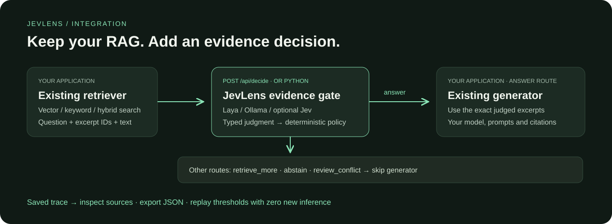

<p align="center"></p>

<p align="center">
  <a href="https://github.com/xi029/jev-lens/actions/workflows/ci.yml"></a>
  
  <a href="LICENSE"></a>
  
</p>

<p align="center"><strong>A local evidence workbench for Laya, Jev and Ollama.</strong><br>Give your RAG a decision layer. See why it answers, asks for evidence, or abstains.</p>
<p align="center"><a href="README.zh-CN.md">简体中文</a> · <a href="#quickstart">Quickstart</a> · <a href="#plug-into-your-existing-rag">Integrate your RAG</a> · <a href="docs/providers.md">Providers</a> · <a href="docs/evaluation.md">Evaluation</a> · <a href="docs/api.md">API</a></p>

## Why JevLens?

Many RAG pipelines pass the top retrieved chunks straight to a generator. That works when the chunks contain the answer. It becomes harder to debug when they merely mention the topic, omit a required detail, or contain two incompatible policies. A retrieval score ranks relevance; it does not establish that the evidence supports the requested answer.

Jev and open-source decision engines such as Laya make an explicit, typed judgment worth exploring: **given this question and these excerpts, is the answer supported, partial, missing, or conflicting?** JevLens turns that idea into a useful local tool with inspectable inputs, a deterministic gate, and saved decisions. Laya supplies an open-weight path; Ollama lets you try the same workflow with models you already have.

**The signature feature: policy replay.** Make the model judgment once, then change support or conflict thresholds on that saved distribution with **zero new model calls**. The original response remains attached to its original policy. This helps developers inspect the effect of a routing policy before changing a live assistant.

The name combines **Jev** with **Lens**: a way to inspect the evidence and policy between retrieval and generation. JevLens is an independent application; its core and local workflow are open source, and hosted Jev is an optional provider.

### When is it useful?

| Situation                                                     | How JevLens helps                                                                   | What your application does next                                          |
| ------------------------------------------------------------- | ----------------------------------------------------------------------------------- | ------------------------------------------------------------------------ |
| A support assistant retrieves a refund policy                 | Judge whether it includes the requested deadline and procedure                      | Generate from judged excerpts when the route is `answer`                 |
| A deployment guide mentions Docker but omits Kubernetes setup | Expose partial evidence instead of letting the generator fill the gap               | Fetch better documentation or ask the user for context                   |
| Two policy versions give different refund windows             | Show the evidence and a conflict route when the decision model detects disagreement | Resolve the source/version conflict before answering                     |
| You are adjusting an assistant's answer threshold             | Replay the same judgment at several thresholds                                      | Inspect route changes, then validate a policy on labelled real questions |

JevLens can skip your generator on a blocked route and make that decision reviewable. Whether this improves factual quality or saves total latency/cost depends on the decision model, retrieval and workload; decision inference itself adds work. The bundled fixture is a smoke evaluation, not evidence of a general performance gain.


_Actual application screenshot in clearly labelled demo mode. Demo scores are a lexical simulation, not AI probabilities._

## What you can do

| Feature                      | What it gives you                                                                                                                               |
| ---------------------------- | ----------------------------------------------------------------------------------------------------------------------------------------------- |
| **Bring your own retrieval** | Send existing search results to `/api/decide`; keep your vector store, framework and generator.                                                 |
| **Decision-first RAG**       | Route to `answer`, `retrieve_more`, `abstain`, or `review_conflict` before generation.                                                          |
| **Open-weight Laya**         | Connect to your own `/v1/systemone` server. Four cyclic label rotations are averaged by default to address a known source of order sensitivity. |
| **Local Ollama**             | Judge evidence and optionally synthesize cited claims with `qwen3.5:4b` or another installed model.                                             |
| **Hosted Jev**               | Use the same typed choice question with a server-side TypeSafe API key.                                                                         |
| **Evidence inspection**      | See exactly the excerpts submitted to the provider, their source IDs, and BM25 retrieval scores.                                                |
| **Policy replay**            | Explore threshold changes without inference or rewriting the original trace.                                                                    |
| **Portable traces**          | Export the question, input, distribution, policy, evidence, timings, and citations as JSON.                                                     |
| **Low-friction demo**        | Explore the entire UI without accounts, keys, weights, embeddings, or a vector database.                                                        |

This is an independent application. [Jev](https://docs.typesafe.ai/introduction) is TypeSafe's hosted decision model. [Laya](https://github.com/NandhaKishorM/laya) is a separate open-source decision engine. [Ollama](https://docs.ollama.com/api/chat) runs the local generative model. Their probability semantics differ; JevLens does not claim interchangeable accuracy or calibration.

## Quickstart

Requires **Python 3.11+** and [uv](https://docs.astral.sh/uv/getting-started/installation/).

```sh
git clone https://github.com/xi029/jev-lens.git
cd jev-lens
uv sync
uv run jevlens demo
uv run jevlens serve
```

Open **[http://127.0.0.1:8787](http://127.0.0.1:8787)**. These commands work in PowerShell, macOS and Linux. Default **demo mode** is clearly marked and makes no model calls or downloads.

<details>
<summary>Use pip or an existing Conda environment</summary>

Activate a Python 3.11+ environment, then:

```sh
python -m pip install -e .
jevlens demo
jevlens serve
```

For example, `conda activate agent` works if that environment has a compatible Python version. Use `python -m pip install -e ".[dev]"` for development.

</details>

### Try the three-minute walkthrough

1. Load sample knowledge and inspect **“How do I request a refund?”**.
2. Move **Minimum support** from 70% to 95%. Replay changes the route while the original response stays visible.
3. Choose **Missing detail** to inspect a question whose exact pricing is absent.
4. Click **Add conflicting policy**. Inspect the refund window with two disagreeing policies.
5. Add a `.md` or `.txt` file and export a trace. **Ctrl / Cmd + Enter** submits.

Samples are original fictional documents. Deleting the draft resolves the demo conflict for future queries. Saved traces retain their original excerpts.

### Use your local Qwen model

Ensure Ollama is running and the model appears in `ollama list`. If needed:

```sh
ollama pull qwen3.5:4b
```

Skip the pull if already installed. Choose **Decision → Ollama · local** and **Answer → Ollama · generate**. No key is needed. To set the startup provider, copy `.env.example` to `.env`:

```dotenv
JEVLENS_PROVIDER=ollama
JEVLENS_OLLAMA_MODEL=qwen3.5:4b
```

Ollama returns **uncalibrated, self-reported LLM estimates**. This is not the same as a Laya or Jev decision head. See [provider setup and troubleshooting](docs/providers.md).

<details>
<summary>Actual local Qwen decision and cited response</summary>


This is a real local request, not the demo simulation. The measured time is shown as recorded; inference speed depends on hardware and concurrent requests.

</details>

### Use open-source Laya as the decision layer

Install Laya separately or use the optional extra:

```sh
uv sync --extra laya
```

PowerShell:

```powershell
$env:LAYA_HOST="127.0.0.1"
$env:LAYA_PORT="8123"
$env:LAYA_MODELS="english"
uv run --extra laya laya-serve
```

macOS / Linux:

```sh
LAYA_HOST=127.0.0.1 LAYA_PORT=8123 LAYA_MODELS=english uv run --extra laya laya-serve
```

In another terminal, run `uv run jevlens serve`, then choose **Laya · open weights**. First startup downloads a Hugging Face checkpoint. See [Providers](docs/providers.md) for CPU-only installation, GPU settings and multilingual models.

## How it works


1. **Retrieve:** split documents into bounded excerpts and rank with BM25. English terms and Chinese bigrams need no embedding downloads. Lexical retrieval can miss semantic paraphrases.
2. **Decide:** ask a four-option coverage question. Laya averages four cyclic label presentations by default; Jev uses a standard single question. Ollama follows a validated JSON schema.
3. **Gate:** empty evidence abstains; conflicts above your trigger go to review; sufficient support answers; otherwise request more evidence or abstain.
4. **Respond:** return verbatim excerpts, or call Ollama only on the `answer` route. Generated claims must cite IDs from the submitted evidence.
5. **Replay:** recompute the route from the saved distribution. No retriever or model is called.

Built with FastAPI, Pydantic and SQLite, with a bundled HTML/CSS/JavaScript workbench. Decision providers are separate from the deterministic policy, so replay does not need a running model.

`retrieve_more` recommends adding better sources; this release does not automatically search the web. `review_conflict` asks you to reconcile sources; it does not infer which policy is authoritative.

## Plug into your existing RAG

Keep your retriever and generator. Insert JevLens **after retrieval and before generation**. Send your question and retrieved chunks to `POST /api/decide`; this endpoint runs no retrieval or answer generation and does not import chunks into the document collection. It saves a trace that you can inspect, export and replay in the workbench.



With `uv run jevlens serve` running, this is a complete, key-free integration request:

```python
import httpx

response = httpx.post(
    "http://127.0.0.1:8787/api/decide",
    json={
        "question": "How do I request a refund?",
        "provider": "demo",  # Use laya or ollama after configuring a real provider.
        "evidence": [
            {
                "id": "refund-1",
                "source": "refund-policy.md",
                "text": "To request a refund, email support with the order number.",
            }
        ],
        "policy": {"support_threshold": 0.70, "conflict_threshold": 0.35},
    },
    timeout=150,
    trust_env=False,
)
response.raise_for_status()  # Stop here on a gate/provider error.
trace = response.json()
print(trace["action"], trace["reason"])
# Call your generator only for action == "answer", using trace["evidence"].
```

Replace `evidence` with results from your existing vector search, keyword search or framework. Use the **returned** excerpts for generation: JevLens may trim input to the provider budget, and the judgment applies to what the model actually saw. Demo scores are a lexical simulation; use a real provider and validate thresholds before applying this to real queries.

| Returned action   | Integration behavior                                                            |
| ----------------- | ------------------------------------------------------------------------------- |
| `answer`          | Allow your generator to use the returned evidence                               |
| `retrieve_more`   | Fetch better evidence, ask a clarifying question, or stop; bound any retry loop |
| `abstain`         | Return an insufficient-evidence response and skip generation                    |
| `review_conflict` | Send the conflicting sources to a person or your source-resolution workflow     |

Try the [runnable adapter](examples/external_rag.py), whose two callbacks can be replaced with your application's retrieval and generation functions:

```sh
uv run python examples/external_rag.py --provider demo
uv run python examples/external_rag.py --provider demo --question "Who won lunar chess?"
# After configuring your local provider:
uv run python examples/external_rag.py --provider ollama
```

The example generator returns verbatim excerpts so the demo needs no extra models. The adapter never calls it on a blocked route or an HTTP error. [Integration guide](docs/integration.md) covers callback contracts, direct Python use without a server, input limits, error handling and trace privacy.

For a standalone knowledge assistant, use the included workbench and `/api/query` instead. That path supplies BM25 retrieval and optional Ollama generation for you. Both paths use the same decision providers and policy logic.

## CLI and API

```sh
uv run jevlens ingest ./my-notes.md
uv run jevlens ask "How do I request a refund?" --provider ollama --generate
uv run python scripts/evaluate.py --provider demo
```

Replay the bundled real Qwen trace without any model running: `uv run python examples/replay.py`.

CLI queries print complete traces. See [API examples](docs/api.md) and local **[/docs](http://127.0.0.1:8787/docs)**. The frontend ships with the Python package and requires no Node build step.

### Docker

```sh
docker compose up --build
```

Compose publishes only on localhost and persists a named volume. Model URLs use `host.docker.internal`; your model server must accept connections from Docker's network. Host services bound strictly to loopback may be unreachable on some systems. Prefer native Python to keep all services loopback-only. The image runs as a non-root user. [Deployment notes](docs/providers.md#docker).

## Evaluation and honest limits

```sh
uv sync --extra dev
uv run ruff check .
uv run ruff format --check .
uv run pytest -q
uv run python scripts/evaluate.py --provider ollama --output artifacts/ollama.json
```

The eight-case fixture is an original fictional **routing smoke evaluation**, not a representative or held-out benchmark. Reports include errors and unexpected routes. We publish no invented speedups, accuracy comparisons, token savings, or hallucination reduction claims. [Methodology and verification](docs/evaluation.md).

- Citation **IDs** are validated. Claim truth and semantic entailment are not automatically verified.
- Character budgets do not guarantee fit within a tokenizer limit. Traces show submitted excerpts; checkpoint-side truncation can still occur.
- Laya's label order, wording and checkpoint affect results. Rotations address one source of bias and do not establish calibration.
- Demo is a lexical simulation with disclosed missing-detail rules, not reasoning over arbitrary documents.
- This is a local, single-user workbench without authentication or document ACLs. [Security](SECURITY.md).

## Roadmap

- [ ] Ready-made framework adapters for external vector retrieval
- [ ] Custom labelled evaluations and risk / coverage curves
- [ ] Compare checkpoints and question schemas on identical evidence
- [ ] Inspectable claim-level entailment checks
- [ ] Trace retention controls and redacted sharing

See [CONTRIBUTING.md](CONTRIBUTING.md) or [open an issue](https://github.com/xi029/jev-lens/issues). If evidence-first tools are useful to you, a star helps others find the project.

## License and acknowledgements

[Apache-2.0](LICENSE). Thanks to [Laya](https://github.com/NandhaKishorM/laya), [TypeSafe's System One API](https://docs.typesafe.ai/api) and [Ollama](https://github.com/ollama/ollama). Weights are not included; upstream models and dependencies retain their own licenses. See [NOTICE](NOTICE).
