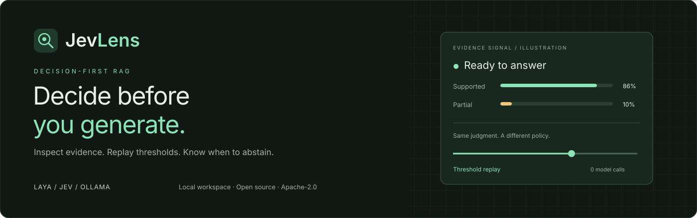
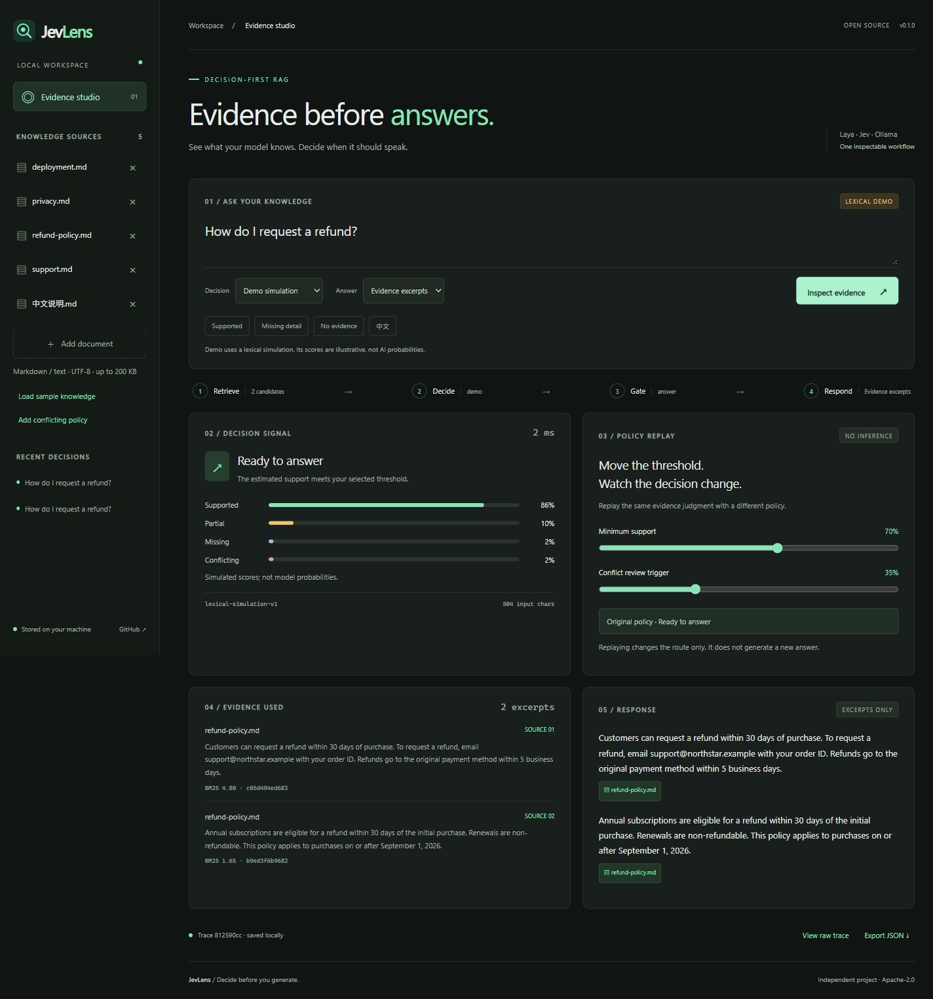
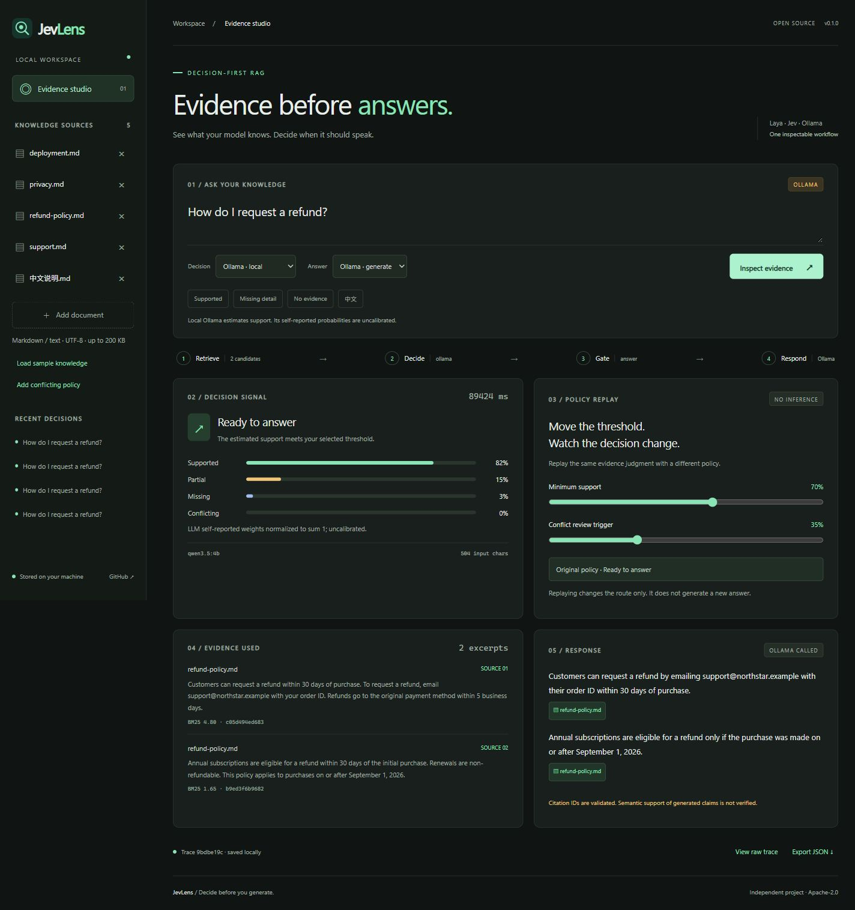
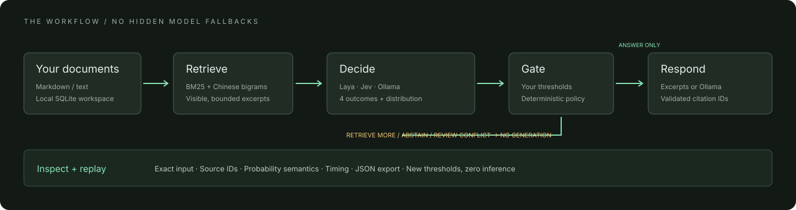

<p align="center"></p>

<p align="center"><strong>面向 Laya、Jev 和 Ollama 的本地证据决策工作台。</strong><br>让 RAG 先判断证据是否充足，再决定回答、补充证据、拒答或审查冲突。</p>
<p align="center"><a href="README.md">English</a> · <a href="docs/providers.md">模型接入</a> · <a href="docs/evaluation.md">评测说明</a> · <a href="docs/api.md">API</a></p>

## 为什么做 JevLens

检索到相关段落，不代表段落足以回答问题。JevLens 在检索和生成之间加入可观察的决策层，展示实际证据、四类判断分布和门控策略。

特色是 **策略回放**：拖动阈值，立即查看同一份判断会走哪条路线，**不再调用模型**，也不改写原回答。适合本地文档助手、客服知识库，以及探索 Jev / Laya 的实际应用。



*截图来自明确标注的 Demo 模式。演示分数由词法规则模拟，并非真实模型概率。*

## 已实现的功能

| 功能 | 用途 |
| --- | --- |
| 四类门控 | 回答、补充证据、拒答、审查冲突；生成模型只在允许回答时调用 |
| 开源 Laya | 接入自行托管的 `/v1/systemone`；默认平均四种循环标签顺序 |
| 本地 Ollama | 支持已有的 `qwen3.5:4b`，用于判断和带引用的生成 |
| 托管 Jev | TypeSafe API Key 保存在服务端 |
| 策略回放 | 修改支持／冲突阈值，零模型调用查看路线变化 |
| 完整记录 | 导出真实输入、证据、分布、策略、引用和耗时 |
| 无模型演示 | 无需账户、密钥、向量数据库或权重下载 |
| 本地知识库 | 上传 UTF-8 Markdown／文本，使用 BM25 和中文双字切片检索 |

这是独立应用，与上游均无隶属关系。[Jev](https://docs.typesafe.ai/introduction) 是托管决策模型；[Laya](https://github.com/NandhaKishorM/laya) 是独立开源实现；Ollama 运行生成式模型。三者效果和分布语义不能简单等同。

## 快速开始

需要 Python 3.11+ 和 [uv](https://docs.astral.sh/uv/getting-started/installation/)。适用于 PowerShell、macOS 和 Linux：

```sh
git clone https://github.com/xi029/jev-lens.git
cd jev-lens
uv sync
uv run jevlens demo
uv run jevlens serve
```

打开 **[http://127.0.0.1:8787](http://127.0.0.1:8787)**。默认是清楚标注的词法演示，任何人首次克隆都能体验。

也可以使用已有 Conda 环境，Python 须为 3.11+：

```sh
conda activate agent
python -m pip install -e .
jevlens demo
jevlens serve
```

### 使用已有的 Qwen

启动 Ollama，确认 `ollama list` 中有 `qwen3.5:4b`，无需重复下载。界面选择 **Decision → Ollama · local** 和 **Answer → Ollama · generate**。

默认启动配置可将 `.env.example` 复制为 `.env`，设置：

```dotenv
JEVLENS_PROVIDER=ollama
JEVLENS_OLLAMA_MODEL=qwen3.5:4b
```

Ollama 分数是模型自行估计的结果，**未经校准**，不会伪装成 Jev／Laya 决策头概率。

<details>
<summary>查看真实本地 Qwen 决策和生成截图</summary>



这是对原创示例资料的真实本地调用。耗时按实际记录展示，速度取决于硬件和并发请求。

</details>

### 使用开源 Laya

```sh
uv sync --extra laya
```

PowerShell 启动服务：

```powershell
$env:LAYA_HOST="127.0.0.1"
$env:LAYA_PORT="8123"
$env:LAYA_MODELS="english"
uv run --extra laya laya-serve
```

另开终端启动 JevLens，选择 **Laya · open weights**。首次需要从 Hugging Face 下载权重；CPU 安装、多语言模型和上下文配置见 [接入文档](docs/providers.md)。

## 三分钟体验

1. 加载示例知识，询问退款申请方式，查看证据和路线。
2. 将支持阈值从 70% 调到 95%，观察回放变化；原回答仍属于原策略。
3. 点击 **Missing detail**，查看价格缺失时如何建议补充资料。
4. 点击 **Add conflicting policy**，观察 14 天与 30 天政策冲突。
5. 上传自己的 `.md`／`.txt` 并导出 JSON。Ctrl／Cmd + Enter 提交。

示例是原创虚构资料。删除草案影响未来检索，旧记录保留当时的证据。

## 工作原理



文档先检索，再由提供方判断证据充分、部分、缺失还是冲突。纯函数策略决定路线，允许回答时才生成。引用须指向本次提交的证据 ID。

`retrieve_more` 建议补充资料，目前不自动搜索网络；`review_conflict` 提示核对来源，目前不自动决定政策优先级。词法检索可能漏掉同义改写。标签轮换只缓解一种顺序偏差，不代表已校准。

## CLI、Docker 和验证

```sh
uv run jevlens ingest ./my-notes.md
uv run jevlens ask "如何申请退款？" --provider ollama --generate
docker compose up --build
```

Docker 仅向本机暴露端口。容器访问本机模型服务时，须确认服务监听地址能被 Docker 网络访问。希望全部服务只监听 loopback 时，推荐直接使用 Python。

```sh
uv sync --extra dev
uv run ruff check .
uv run ruff format --check .
uv run pytest -q
uv run python scripts/evaluate.py --provider ollama --output artifacts/ollama.json
```

八个原创样例用于路线和集成验证，**不构成通用准确率榜单**。错误和非预期路线均写入报告，见 [评测说明](docs/evaluation.md)。

引用 ID 会验证，但生成内容是否真实、引用是否在语义上支持断言，尚未自动验证。字符预算不保证符合 tokenizer 的上下文限制。项目是单人本地工作台，没有多用户认证或文档 ACL；请阅读 [安全说明](SECURITY.md)。

## 后续方向

- 语义检索与重排适配器
- 自定义标注集和风险／覆盖率曲线
- 相同证据下比较模型和问题模板
- 可检查的逐条断言支持度验证
- 记录保留期限和脱敏分享

欢迎按 [贡献指南](CONTRIBUTING.md) 提交实用改进。如果方向对你有帮助，Star 能让更多人发现它。

[Apache-2.0](LICENSE)。仓库不分发模型权重，上游各自遵循其许可证。致谢 [Laya](https://github.com/NandhaKishorM/laya)、[TypeSafe API](https://docs.typesafe.ai/api) 和 [Ollama](https://github.com/ollama/ollama)。
