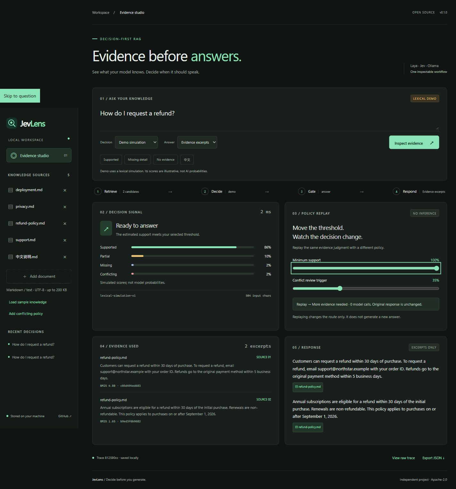

# Evaluation and verification

JevLens separates integration correctness from model quality. A correct interface can return a wrong judgment, and a high score is not automatically reliable.

## The fixture

`scripts/evaluate.py` runs eight routing cases on original fictional Northstar documents: refund instructions, deployment port, database, privacy, absent pricing, unrelated missing evidence, Chinese deployment, and conflicting refund policies.

The expected routes are manually authored with a fixed policy: support ≥ 0.70; conflict ≥ 0.35. The samples and schema were used during development. They are **not held out, representative, independently labelled, or a benchmark against other RAG systems**.

```sh
uv run python scripts/evaluate.py --provider demo --output artifacts/demo.json
uv run python scripts/evaluate.py --provider ollama --output artifacts/ollama.json
uv run python scripts/evaluate.py --provider laya --output artifacts/laya.json
```

Reports include expected and actual routes, normalized distributions, original Ollama weights, provider usage, errors, timings and configuration. Temporary databases are isolated from the user's workspace. Provider errors exit nonzero and stay in the report. Route mismatches stay visible; the runner does not fail simply because a model disagreed.

## Local checks on October 2, 2026

Original reports and a generated trace are included under [`docs/examples`](examples/). They contain only fictional sample knowledge. Run `uv run python examples/replay.py` to change thresholds on the real Qwen trace entirely offline.

Windows, Python 3.12.14. Providers: Ollama 0.30.6 with the existing `qwen3.5:4b`; Laya 0.3.23 with its English checkpoint on CPU and four label rotations. Both live providers completed all eight fixture requests with no provider errors after integration repairs.

At default thresholds, Laya matched 4 of the 8 authored routes and Qwen matched 6 of 8 in the recorded run. Demo matched 6 of 8. **These are fixture outcomes, not general accuracy or provider rankings.** Evidence budgets differ, the sample is tiny, and scores can change across versions. Both live providers routed the conflicting refund fixture to `retrieve_more`, rather than the authored `review_conflict`. Qwen routed the Chinese fixture to `retrieve_more`; Laya routed missing pricing to conflict review. We retain these outcomes rather than tuning the fixture to make the results look better.

Provider-reported truncation blocks generation, including replay. Unknown citation IDs, invalid probabilities and provider failures are rejected. Citation validation checks identity, not semantic support.

The final Qwen run used one disclosed schema-repair retry for the deployment question. The repaired result and retry count are in the bundled report. Automated tests: 33 passed. JavaScript syntax, Python lint and formatting checks passed; a wheel was installed in a clean environment and its workbench app loaded successfully.

Automated checks cover routing boundaries, empty-evidence short circuits, conflict blocking, unchanged original traces after replay, uploads, deduplication, local origins, stable multilingual retrieval, provider contracts, option balancing, original Ollama weights and invalid citations. Package archives include workbench assets and exclude databases, models, secrets and caches.

UI checked at 375, 768, 1024 and 1440 pixels with no horizontal overflow. Actual replay screenshot:



Docker was not run in this local verification. GitHub Actions runs the lint, tests, demo evaluation and build on Windows/Linux with Python 3.11–3.13; see the [published CI results](https://github.com/xi029/jev-lens/actions/workflows/ci.yml) for those platforms.

## Publication checks on October 3, 2026

The external evidence API and runnable callback adapter were added after the original fixture run. Final local checks: 48 tests passed; Python lint/format, JavaScript syntax and Markdown/frontend formatting passed. Both external demo routes (answer and abstain), the direct Python entry point and offline policy replay were exercised. The external adapter also completed a real request with the installed `qwen3.5:4b`, which allowed the fictional supported refund answer. This single request verifies integration, not model accuracy.

The demo fixture retained its 6/8 authored route outcomes. The wheel and source distribution built successfully and were inspected for private/runtime paths; none were present. The new SVG integration diagram was rendered and inspected. No additional live Laya or hosted Jev evaluation was performed in this final check.

## Evaluate your own deployment

Collect real questions and freeze the evidence each retriever returns. Label whether it fully supports an answer, misses details, has no answer, or conflicts. Use an independent split to choose thresholds. Evaluate checkpoints, languages and question wording separately.

Report answer coverage alongside errors among accepted answers. Include calibration, provider failures, truncation and generation quality. Compare providers on identical evidence and timing boundaries. Separate cold loading from warm inference. A confidence field or a tiny demo cannot establish factual accuracy.
